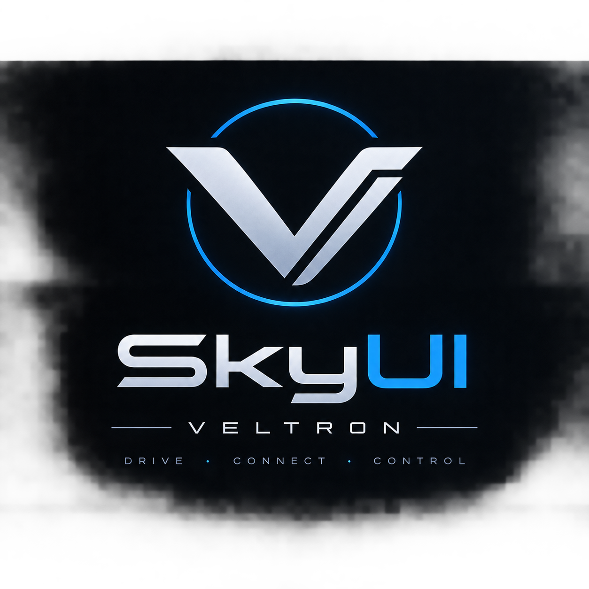

# Veltron OS — SkyUI

<p align="center">
  
</p>

<p align="center">
  <strong>Next-Generation Automotive Infotainment Operating System</strong><br/>
  Designed for the Veltron Electric Vehicle Ecosystem
</p>

<p align="center">
  
  
  
  
</p>

---

## 📌 Executive Overview

**SkyUI** is a custom, automotive-grade digital cockpit and infotainment human-machine interface (HMI) built from the ground up for future **Veltron** electric vehicles. 

> [!IMPORTANT]
> **SkyUI is NOT a mobile or tablet application.** It is an in-vehicle automotive digital cockpit interface engineered for low driver distraction, 60 FPS real-time fluid animations, ultrawide aspect ratios, and deep vehicle hardware telemetry.

---

## 🚀 Current Status & Progress Matrix

### Release Tag: `v0.2.0-alpha` (Build 2026.09)

We have transitioned from initial wireframes to a fully functional, animated 21:9 ultrawide automotive cockpit dashboard.

| Module / System | Status | Version / Details |
| :--- | :---: | :--- |
| **System Architecture & Theme** | ✅ Complete | Modular UI hierarchy, custom Veltron Dark tokens, responsive scale |
| **21:9 Ultrawide Layout Engine** | ✅ Complete | Golden proportion grid (7:4:5 ratio for Vehicle, Media/Phone, Navigation) |
| **Vehicle Telemetry Card** | ✅ Complete | Battery state (76%), real-time range estimation (385 km), doors lock indicator, car render, quick actions (Search, Charging, Climate, Driver Profile) |
| **Media Player Card** | ✅ Complete | Custom vinyl disc visualizer, track metadata, playback controls, dual-duration progress bar |
| **Phone & Connectivity Card** | ✅ Complete | Paired device telemetry ("Marko's iPhone"), signal strength meter, battery gauge, direct call/message triggers |
| **Interactive Navigation Card** | ✅ Complete | Custom vector map background, road grid generator, glowing cyan route preview, turn overview |
| **Full-Screen Navigation Overlay** | ✅ Complete | Smooth spring-expansion transition, turn-by-turn instruction HUD, destination card, live stats (Speed, Distance, ETA, Route) |
| **Aerodynamic Climate Control Bar** | ✅ Complete | Slanted edge automotive silhouette with racing red accent, dual-zone independent temps (0.5° increments), 3-stage heated seats, 4-level fan controls with AUTO mode, center trip efficiency diagnostics |
| **Persistent Vertical Sidebar** | ✅ Complete | Veltron badge, quick-switch navigation icons, active amber indicator |
| **Status Header & Connectivity** | ✅ Complete | Brand emblem, live system clock, LTE/5G, Wi-Fi, Bluetooth status indicators |
| **Standalone 21:9 App Runner** | ✅ Complete | Borderless browser app launcher (`run_app.bat` / `run_app.py`) for native 1680x720 ultrawide cockpit simulation |
| **CAN Bus / OBD-II Hardware Bridge**| 🔄 In Progress | Virtual telemetry feed mock for testing vehicle signals |
| **Voice / AI Assistant** | ⏳ Planned | Veltron AI contextual voice control |
| **OTA Update Engine** | ⏳ Planned | Cryptographically signed firmware / UI delta updates |

---

## 📸 Cockpit Showcase & Core Features

```
┌──────────────────────────────────────────────────────────────────────────────────────────────────┐
│  VELTRON OS               [ 21:9 Automotive Digital Cockpit ]                       18°C  20:45  │
├────┬─────────────────────────────┬──────────────────────────┬────────────────────────────────────┤
│    │  VEHICLE TELEMETRY          │  CONNECTED MEDIA         │  NAVIGATION SYSTEM                 │
│ [=]│  • Ready to Drive           │  • "Night Drive"         │  • Live Vector Map Canvas          │
│    │  • Battery: 76% (385 km)    │  • Veltron Sounds        │  • Glowing Route Trail             │
│ [N]│  • Doors: Locked            │  • Transport Controls    │  • Expanding Full-Screen Mode      │
│    │  • 3D Vehicle Render        ├──────────────────────────┤  • Turn-by-turn guidance HUD       │
│ [M]│  • Quick Charging/Profile   │  PHONE & COMMS           │  • Live Speed & ETA Telemetry      │
│    │                             │  • Marko's iPhone (5G)   │                                    │
│ [P]│                             │  • Battery & Signal Bar  │                                    │
├────┴─────────────────────────────┴──────────────────────────┴────────────────────────────────────┤
│  CLIMATE CONTROL BAR: [ 22.0°C | Heated Seats Lvl 3 | Fan Speed 3 ]  [ 14.0% Eff ]  [ 22.0°C ]   │
└──────────────────────────────────────────────────────────────────────────────────────────────────┘
```

### 1. 21:9 Ultrawide Golden Layout
- Tailored for modern automotive panoramic dash displays.
- Mathematically balanced 7:4:5 column split keeps critical vehicle stats closest to the driver.

### 2. Animated Full-Screen Navigation Expansion
- Tapping the compact Navigation card triggers a 350ms cubic ease transition.
- Adjacent cards smoothly fade while the map expands to fill the entire upper deck.
- Includes turn-by-turn HUD, destination details, speed, trip distance, and estimated arrival time.

### 3. Dual-Zone Aerodynamic Climate Panel
- Custom canvas-clipped geometry with aerodynamic 20px slant and signature red accent stripe.
- Independent driver and passenger temperature controls in 0.5° increments.
- 3-level seat heater toggle with animated status LEDs and 4-speed fan control with auto-regulation.

---

## 🛠 Project Architecture

```
lib/
├── core/
│   ├── animations/          # Curve & timing specifications
│   ├── constants/           # Display & layout constants
│   ├── icons/               # Custom automotive vector icon set
│   └── theme/               # Veltron Design System (colors, styles, radii)
├── models/                  # Data contracts (Vehicle, Media, Route, Climate)
├── screens/
│   ├── home/                # Main dashboard coordinator & animation controller
│   └── navigation/          # Expanded full-screen navigation layout
├── services/                # Hardware bridges, telemetry, audio session
└── widgets/
    ├── app_card.dart        # Base automotive card surface
    ├── cards/               # Vehicle, Media, Phone, Navigation cards
    ├── climate/             # Aerodynamic bottom dual-zone climate panel
    ├── header/              # System status bar & telemetry indicators
    └── sidebar/             # Automotive quick-access vertical navigation rail
```

---

## ⚡ Getting Started

### Prerequisites
- **Flutter SDK**: `>= 3.12.0 < 4.0.0`
- **Dart SDK**: Compatible with Flutter release
- **Python 3.x** (for the standalone 21:9 ultrawide borderless launcher)
- **Google Chrome** or **Microsoft Edge** (for app-window desktop preview)

### Installation & Launch

1. **Clone the repository:**
   ```bash
   git clone https://github.com/VeltronCars/SkyUI.git
   cd SkyUI
   ```

2. **Fetch dependencies:**
   ```bash
   flutter pub get
   ```

3. **Run via Standalone 21:9 Ultrawide Desktop Simulator (Recommended):**
   ```bash
   # Builds web target and launches borderless 1680x720 ultrawide window
   run_app.bat
   ```
   *Or execute directly with Python:*
   ```bash
   python run_app.py
   ```

4. **Run via native Flutter targets:**
   ```bash
   # Windows Desktop
   flutter run -d windows

   # Chrome Web
   flutter run -d chrome
   ```

---

## 📜 Terms of Service & Alpha Disclaimer

> ### **VELTRON OS / SKYUI ALPHA SOFTWARE DISCLAIMER**
> **Current Release Version:** `v0.2.0-alpha`  
> **Effective Date:** September 2026

PLEASE READ CAREFULLY BEFORE USING, INSTALLING, OR TESTING THIS SOFTWARE.

### 1. Alpha Stage & Experimental Status
SkyUI is distributed as an **Alpha version** for evaluation, testing, and concept prototyping purposes only. Features, architecture, visual interfaces, and APIs are subject to radical change without notice.

### 2. Automotive & Safety Disclaimer
- **NOT CERTIFIED FOR ACTIVE ROAD USE:** SkyUI is currently a prototype HMI. It is **NOT** certified under ISO 26262 (Functional Safety), UNECE, DOT, or automotive regulatory standards for direct vehicle control.
- **NO DRIVER DISTRACTION RESPONSIBILITY:** Under no circumstances should this software be operated on an active vehicle display while driving on public roads without independent secondary safety monitors. The driver bears 100% legal responsibility for vehicle control and traffic compliance at all times.

### 3. "AS-IS" Warranty Disclaimer
THE SOFTWARE IS PROVIDED "AS IS", WITHOUT WARRANTY OF ANY KIND, EXPRESS OR IMPLIED, INCLUDING BUT NOT LIMITED TO THE WARRANTIES OF MERCHANTABILITY, FITNESS FOR A PARTICULAR PURPOSE, AND NON-INFRINGEMENT. IN NO EVENT SHALL VELTRON CARS, ITS CONTRIBUTORS, OR DEVELOPERS BE LIABLE FOR ANY CLAIM, DAMAGES, ACCIDENTS, LOSS OF VEHICLE TELEMETRY, OR OTHER LIABILITY.

### 4. Proprietary Intellectual Property & License
SkyUI, the Veltron identity, visual assets, vehicle models, and custom UI components are proprietary intellectual property of **Veltron Cars**. Unauthorized reverse engineering, redistribution, or commercial vehicle deployment without explicit corporate authorization is strictly prohibited.

For the full detailed terms, legal restrictions, and testing agreements, see [docs/terms_of_service.md](docs/terms_of_service.md).

---

## 📚 Documentation Index

Explore the engineering specifications in [`docs/`](docs/):

- 📐 [Architecture Guide](docs/architecture.md) — High-level architecture, module contracts, and layers.
- 🎨 [Design System](docs/design_system.md) — Color tokens, typography, radii, and automotive rules.
- 📦 [Module Catalog](docs/modules.md) — Deep-dive into each component and card.
- 🗺 [Engineering Roadmap](docs/roadmap.md) — From Alpha to Beta and hardware validation.
- 📝 [Changelog](docs/changelog.md) — Version history and release notes.
- ⚖️ [Terms of Service](docs/terms_of_service.md) — Comprehensive legal & Alpha disclaimers.

---

<p align="center">
  <sub>Copyright © 2026 Veltron Cars. All rights reserved.</sub>
</p>